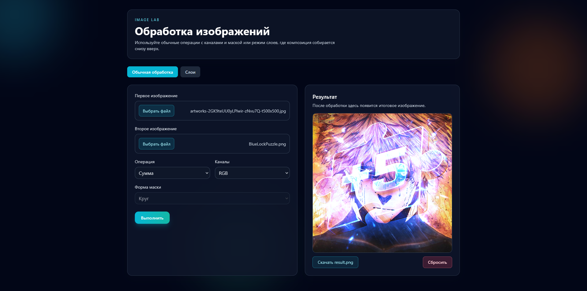
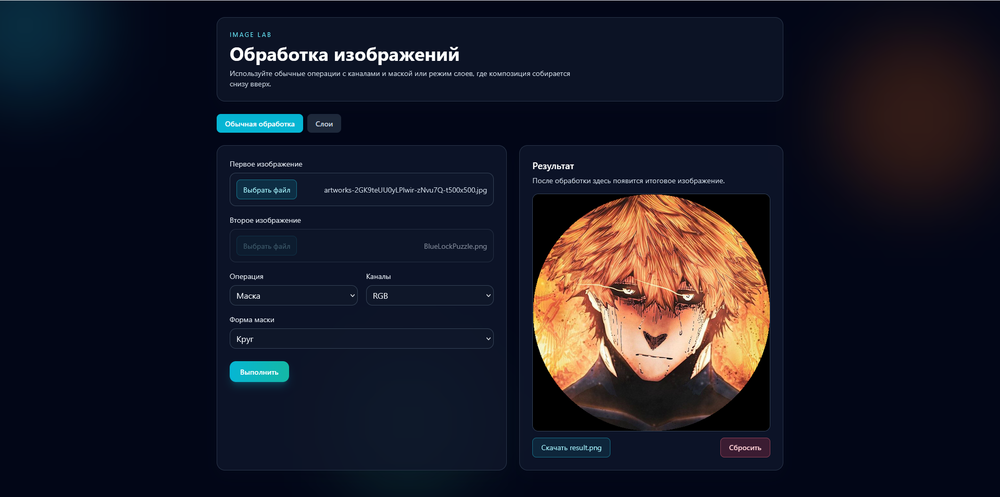
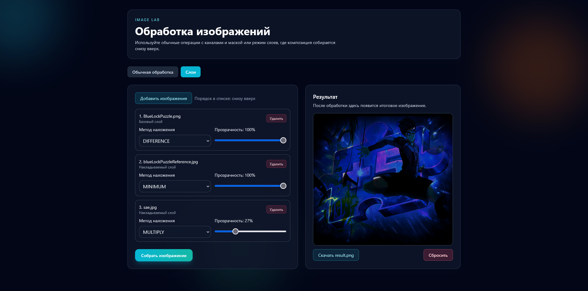

# Image Processor


Веб-приложение для обработки изображений.





Стек:

1. Backend: Spring Boot (Java 21)
2. Frontend: Vue 3 + Vite + Tailwind CSS

## Возможности

Приложение поддерживает 2 режима работы.

### 1. Обычная обработка

1. Операции: `SUM`, `MULTIPLY`, `AVERAGE`, `MINIMUM`, `MAXIMUM`, `MASK`
2. Каналы: `RGB`, `R`, `G`, `B`, `RG`, `GB`, `RB`
3. Маска: `CIRCLE`, `SQUARE`, `RECTANGLE`
4. Для `MASK` второе изображение не требуется

### 2. Слои (аналог панели слоев)

1. Изображения добавляются в список в порядке открытия
2. Для каждого слоя задаются:
   1. Режим наложения: `NONE`, `SUM`, `DIFFERENCE`, `MULTIPLY`, `AVERAGE`, `MINIMUM`, `MAXIMUM`
   2. Прозрачность (0-100%)
3. Композиция строится по списку слоев снизу вверх
4. Размеры изображений могут быть любыми

## Архитектура backend

Используется слоистая структура `api / application / domain`.

1. API (web): HTTP-слой
   1. [src/main/java/by/michael/api/ImageController.java](src/main/java/by/michael/api/ImageController.java)
   2. [src/main/java/by/michael/api/GlobalExceptionHandler.java](src/main/java/by/michael/api/GlobalExceptionHandler.java)
   3. [src/main/java/by/michael/api/dto/ApiError.java](src/main/java/by/michael/api/dto/ApiError.java)
2. Application: orchestration/use-cases
   1. [src/main/java/by/michael/application/ImageProcessingService.java](src/main/java/by/michael/application/ImageProcessingService.java)
3. Domain: чистая бизнес-логика обработки
   1. [src/main/java/by/michael/domain/image/ImageProcessor.java](src/main/java/by/michael/domain/image/ImageProcessor.java)
   2. [src/main/java/by/michael/domain/image/MaskFactory.java](src/main/java/by/michael/domain/image/MaskFactory.java)
   3. [src/main/java/by/michael/domain/image/LayerComposer.java](src/main/java/by/michael/domain/image/LayerComposer.java)
   4. [src/main/java/by/michael/domain/image/BlendMode.java](src/main/java/by/michael/domain/image/BlendMode.java)
4. Bootstrap
   1. [src/main/java/by/michael/Main.java](src/main/java/by/michael/Main.java)

## Структура проекта

1. Backend: [src/main/java](src/main/java)
2. Frontend source: [frontend](frontend)
3. Production-статика, отдаваемая Spring: [src/main/resources/static](src/main/resources/static)
4. Gradle автосборка фронта: [build.gradle.kts](build.gradle.kts)

## Требования

1. JDK 21
2. Bun
3. Gradle Wrapper

Проверка:

```powershell
java -version
bun --version
```

Если `bun` не найден, установите Bun: https://bun.sh

## Запуск

### Вариант 1. Через Gradle (рекомендуется)

```powershell
.\gradlew.bat clean build
.\gradlew.bat bootRun
```

Во время `build` автоматически выполняется:

1. `bun install` в [frontend](frontend) (выполняется инкрементально, если зависимости не менялись)
2. `bun run build` в [frontend](frontend)
3. очистка [src/main/resources/static](src/main/resources/static)
4. копирование `frontend/dist` в [src/main/resources/static](src/main/resources/static)

После запуска:

1. Приложение: `http://localhost:8080`

### Вариант 2. Раздельный dev-режим

Backend:

```powershell
.\gradlew.bat bootRun
```

Frontend:

```powershell
cd frontend
npm install
npm run dev
```

или через Bun:

```powershell
bun install
bun run dev
```

Адреса:

1. Backend API: `http://localhost:8080`
2. Frontend dev: `http://localhost:5173`

## API

Базовый путь: `/api/images`

### 1. Обычная обработка

`POST /api/images/process`

`multipart/form-data` параметры:

1. `image1` (обязательный)
2. `image2` (обязательный для операций кроме `MASK`)
3. `operation` (`SUM | MULTIPLY | AVERAGE | MINIMUM | MAXIMUM | MASK`)
4. `channels` (`RGB | R | G | B | RG | GB | RB`)
5. `maskShape` (`CIRCLE | SQUARE | RECTANGLE`, опционально, default `CIRCLE`)

Ответ: PNG (`image/png`)

### 2. Композиция слоев

`POST /api/images/compose`

`multipart/form-data` параметры (по индексам):

1. `images` (список файлов)
2. `modes` (список blend mode)
3. `opacities` (список значений `0..1`)

Важно: длины списков `images`, `modes`, `opacities` должны совпадать.

Ответ: PNG (`image/png`)

## Алгоритм обработки

### Обычный режим

1. Базой становится изображение с большей площадью
2. Второе изображение масштабируется на размер базы через отображение координат:

$$
x_s = round\left(x \cdot \frac{W_s - 1}{W_t - 1}\right),\quad
y_s = round\left(y \cdot \frac{H_s - 1}{H_t - 1}\right)
$$

3. Каналы извлекаются из `int rgb`:

```text
R = (rgb >> 16) & 255
G = (rgb >> 8) & 255
B = rgb & 255
```

4. Операция применяется только к выбранным каналам
5. Для `MASK` маска строится по центру изображения, вне маски выбранные каналы зануляются

### Режим слоев

1. Определяется итоговый холст как `max(width)` и `max(height)` по всем слоям
2. Первый слой кладется как база с учетом его opacity
3. Каждый следующий слой:
   1. масштабируется на итоговый размер
   2. комбинируется с текущим результатом по выбранному blend mode
   3. смешивается с учетом opacity

Смешивание канала:

$$
out = base \cdot (1 - \alpha) + blended \cdot \alpha
$$

где $\alpha \in [0,1]$.

## Frontend

Основной UI: [frontend/src/App.vue](frontend/src/App.vue)

1. Переключение режимов: обычный / слои
2. Кастомные file picker элементы
3. Управление слоями: добавление, удаление, режим наложения, прозрачность
4. Вывод результата и скачивание PNG

## Частые проблемы

1. `Unsupported class file major version 69`
   1. Убедитесь, что используется JDK 21
   2. Выполните `clean` перед сборкой
2. `bun` не запускается в PowerShell
   1. Убедитесь, что Bun установлен и добавлен в PATH
3. Ошибка по `modes/opacities`
   1. Количество значений должно совпадать с количеством `images`

## Полезные команды

```powershell
.\gradlew.bat tasks --group frontend
.\gradlew.bat clean build
.\gradlew.bat bootRun
```
